# AlgoTrendy v2.6 - System Architecture

This document provides visual diagrams and explanations of the AlgoTrendy system architecture.

## Table of Contents

- [System Overview](#system-overview)
- [Component Architecture](#component-architecture)
- [Data Flow Diagrams](#data-flow-diagrams)
- [Sequence Diagrams](#sequence-diagrams)
- [Deployment Architecture](#deployment-architecture)
- [Database Schema](#database-schema)

---

## System Overview

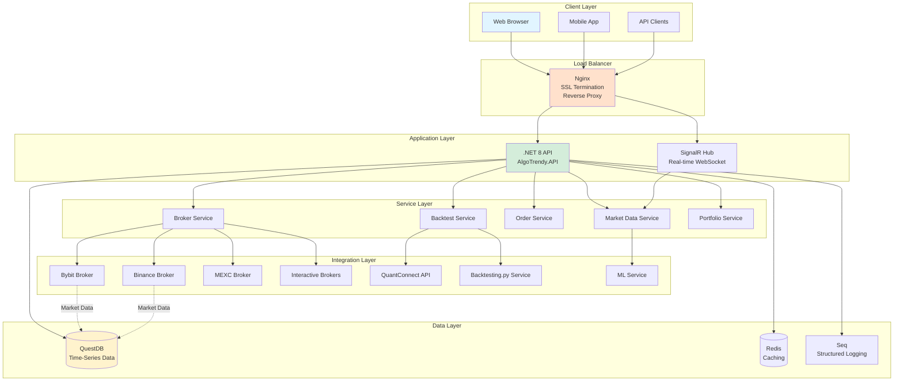

---

## Component Architecture

### Backend Components

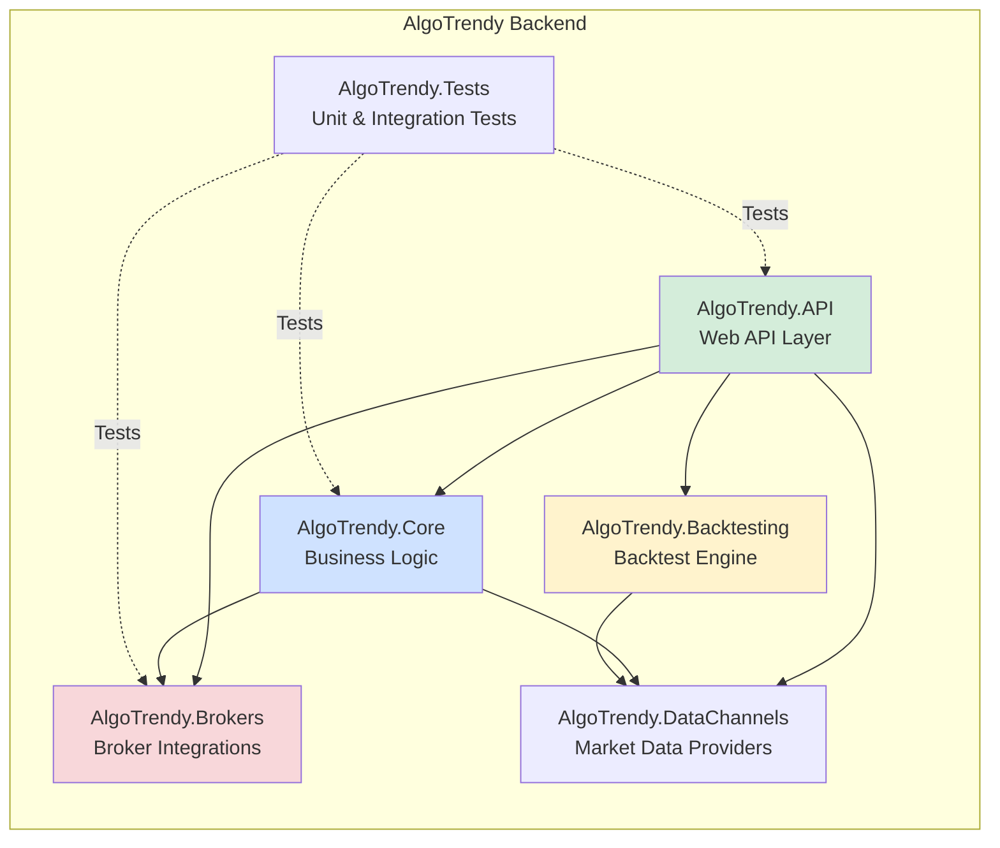

### Service Architecture

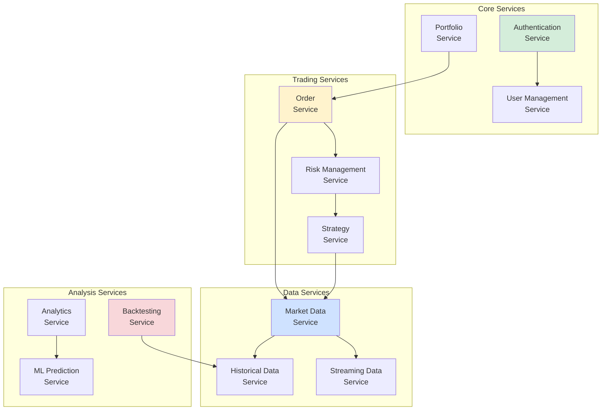

---

## Data Flow Diagrams

### Market Data Flow

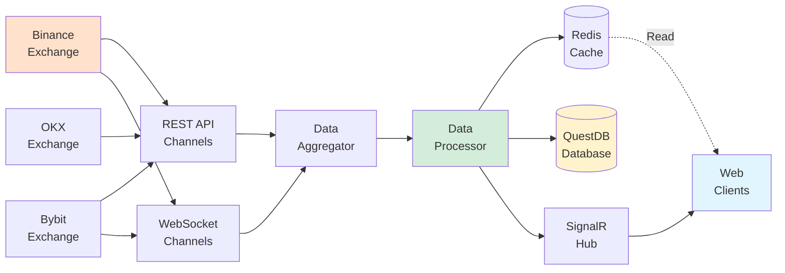

### Order Execution Flow

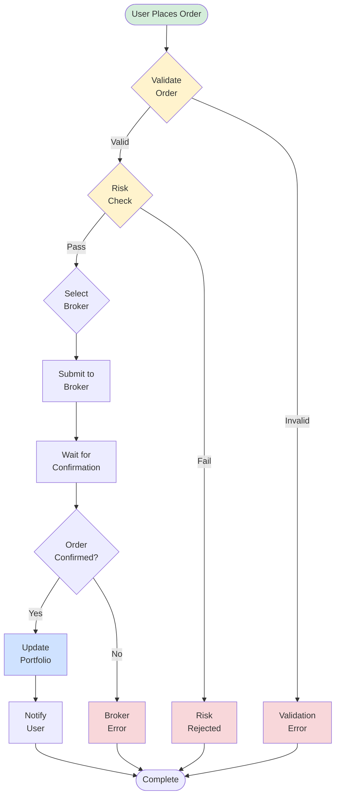

---

## Sequence Diagrams

### User Login & Authentication

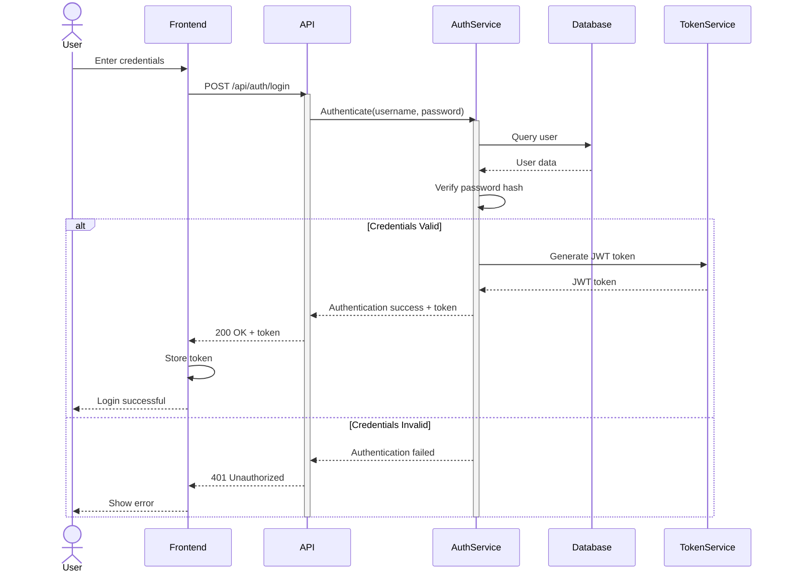

### Place Market Order

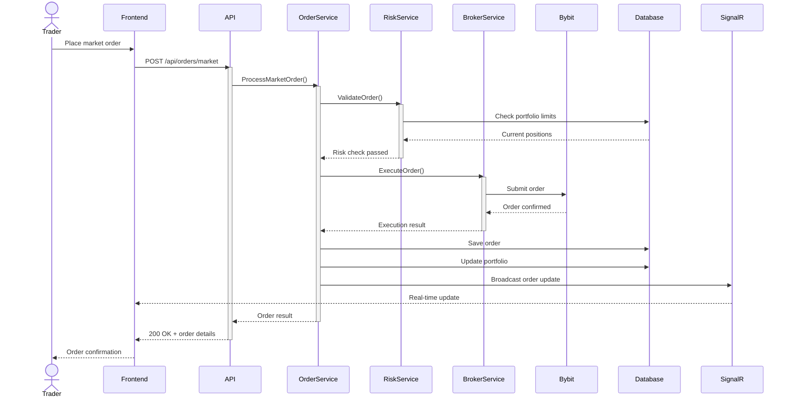

### Backtest Execution

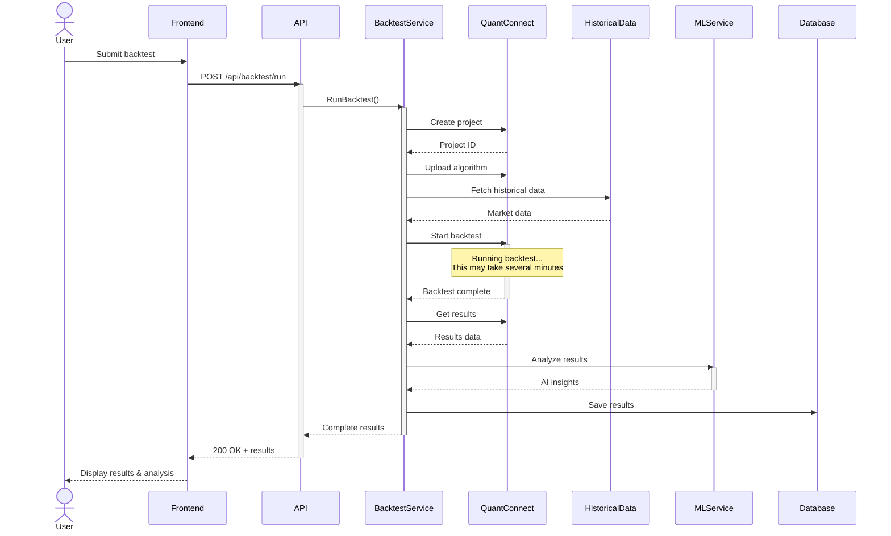

---

## Deployment Architecture

### Production Deployment (Docker)

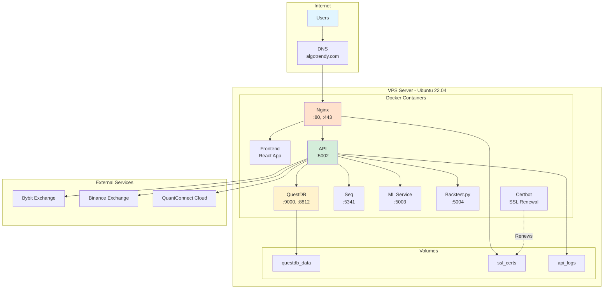

### Network Topology

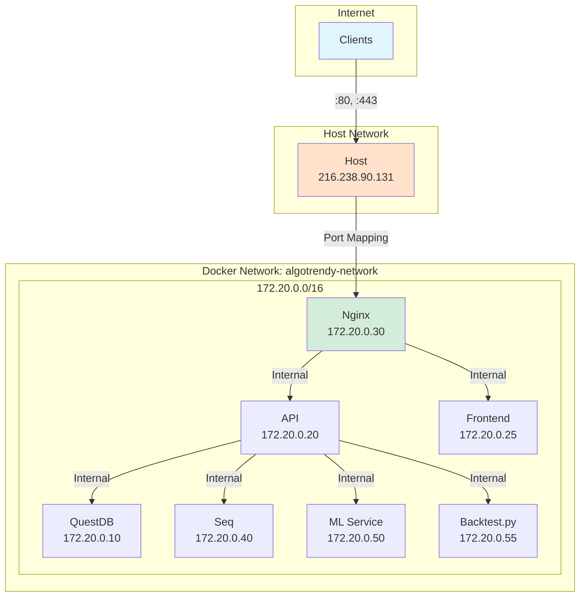

---

## Database Schema

### QuestDB Tables

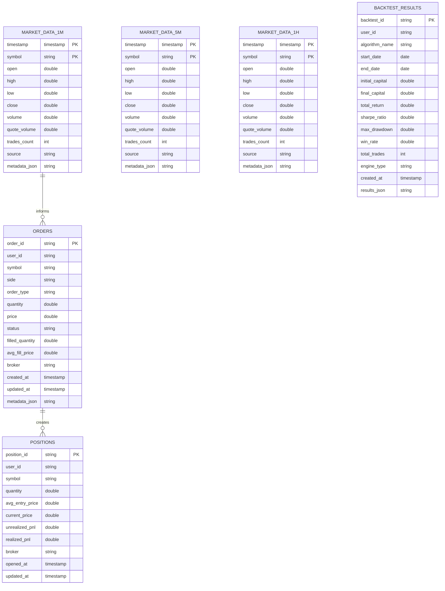

---

## Technology Stack

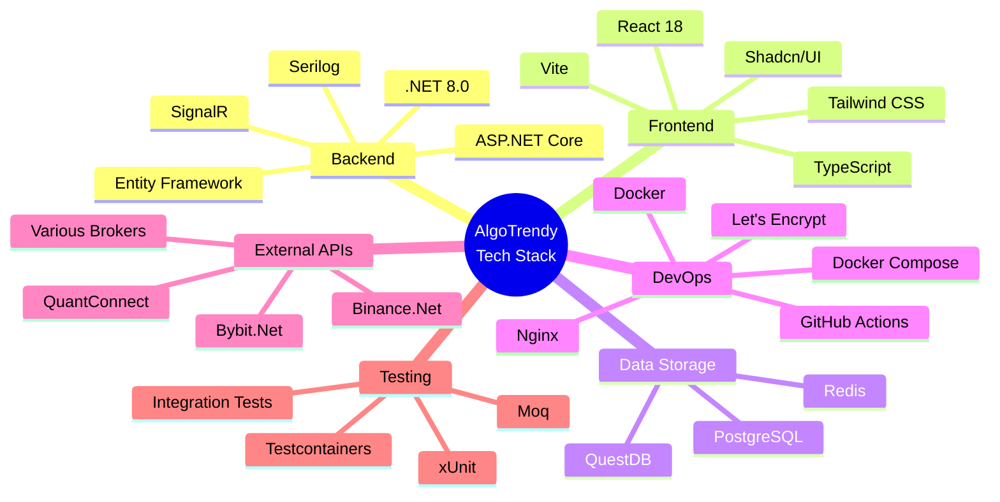

---

## Security Architecture

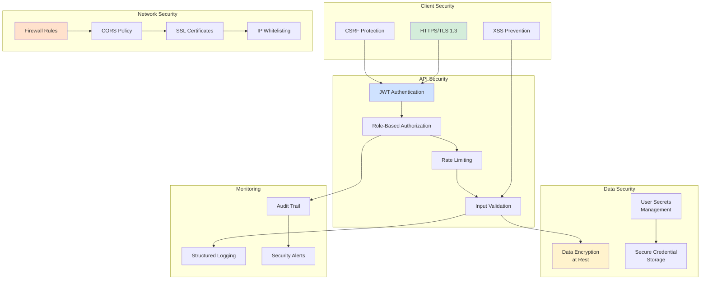

---

## Scaling Strategy

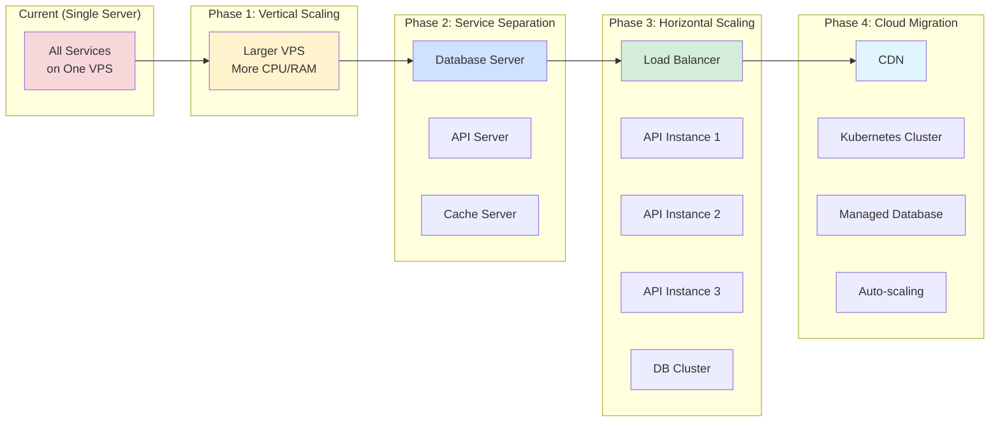

---

## Monitoring & Observability

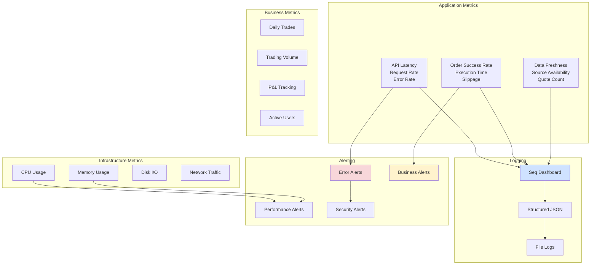

---

## Summary

This architecture provides:

✅ **Scalability** - Horizontal scaling capabilities
✅ **Reliability** - Multiple data sources and fallbacks
✅ **Security** - Multi-layer security implementation
✅ **Performance** - Caching and optimized data flow
✅ **Maintainability** - Clean separation of concerns
✅ **Observability** - Comprehensive logging and monitoring

For implementation details, see:
- [CONTRIBUTING.md](../CONTRIBUTING.md) - Development guidelines
- [API_USAGE_EXAMPLES.md](API_USAGE_EXAMPLES.md) - API integration examples
- [SWAGGER_ENHANCEMENT_GUIDE.md](SWAGGER_ENHANCEMENT_GUIDE.md) - API documentation

---

*Last Updated: October 21, 2025*
