# AlgoTrendy v2.6 - Complete Architecture Diagrams

**Version:** 2.6
**Last Updated:** October 19, 2025
**Purpose:** Comprehensive visual mapping of all system components, data flows, and architecture

---

## Table of Contents

1. [System Architecture Overview](#1-system-architecture-overview)
2. [Backend Component Architecture](#2-backend-component-architecture)
3. [.NET Solution Structure](#3-net-solution-structure)
4. [Data Flow Architecture](#4-data-flow-architecture)
5. [Broker Integration Architecture](#5-broker-integration-architecture)
6. [Backtesting Engine Flow](#6-backtesting-engine-flow)
7. [Data Channels Architecture](#7-data-channels-architecture)
8. [API Layer Structure](#8-api-layer-structure)
9. [Database Architecture](#9-database-architecture)
10. [Deployment Architecture](#10-deployment-architecture)
11. [Trading Execution Flow](#11-trading-execution-flow)
12. [Real-Time Streaming Architecture](#12-real-time-streaming-architecture)
13. [Security & Authentication Flow](#13-security--authentication-flow)
14. [External Integrations Map](#14-external-integrations-map)

---

## 1. System Architecture Overview

High-level view of the entire AlgoTrendy platform with all major components.

```mermaid
graph TB
    subgraph "Frontend Layer"
        WEB[Next.js Web App]
        MOB[Mobile App - Future]
    end

    subgraph "API Gateway"
        API[AlgoTrendy.API<br/>ASP.NET Core 8]
        SIGNALR[SignalR Hubs<br/>Real-time Streaming]
    end

    subgraph "Core Services"
        CORE[AlgoTrendy.Core<br/>Business Logic]
        ENGINE[AlgoTrendy.TradingEngine<br/>Order Management]
        BACKTEST[AlgoTrendy.Backtesting<br/>Strategy Testing]
        DATACHAN[AlgoTrendy.DataChannels<br/>Market Data]
    end

    subgraph "Infrastructure Layer"
        INFRA[AlgoTrendy.Infrastructure<br/>Brokers & Repos]
        ABSTRACTIONS[AlgoTrendy.Common.Abstractions<br/>Interfaces]
    end

    subgraph "Data Providers"
        ALPHA[Alpha Vantage<br/>FREE - 500 calls/day]
        YFINANCE[yfinance<br/>FREE - Unlimited]
        BINANCE[Binance API]
        BYBIT[Bybit API]
        OKX[OKX API]
        COINBASE[Coinbase API]
        KRAKEN[Kraken API]
    end

    subgraph "Databases"
        POSTGRES[(PostgreSQL 16<br/>Users, Orders, Configs)]
        QUESTDB[(QuestDB<br/>Time-Series Data)]
        REDIS[(Redis 7<br/>Cache & Backplane)]
    end

    subgraph "External Systems"
        BROKERS[Trading Brokers<br/>Binance, Bybit, IB, etc.]
        TV[TradingView<br/>Webhooks]
        FREQTRADE[Freqtrade Bots<br/>Multi-bot Portfolio]
    end

    subgraph "AI/ML Layer - Planned"
        LANGGRAPH[LangGraph<br/>Agent Workflows]
        MEMGPT[MemGPT<br/>Agent Memory]
        VECTOR[(Vector DB<br/>Pinecone/Weaviate)]
    end

    WEB --> API
    MOB -.-> API
    API --> CORE
    API --> ENGINE
    API --> BACKTEST
    API --> DATACHAN
    SIGNALR --> CORE

    CORE --> INFRA
    ENGINE --> INFRA
    BACKTEST --> INFRA
    DATACHAN --> INFRA

    INFRA --> ABSTRACTIONS

    DATACHAN --> ALPHA
    DATACHAN --> YFINANCE
    DATACHAN --> BINANCE
    DATACHAN --> BYBIT
    DATACHAN --> OKX
    DATACHAN --> COINBASE
    DATACHAN --> KRAKEN

    INFRA --> BROKERS
    API --> TV
    API --> FREQTRADE

    CORE --> POSTGRES
    CORE --> QUESTDB
    CORE --> REDIS
    ENGINE --> POSTGRES
    ENGINE --> REDIS
    BACKTEST --> QUESTDB
    DATACHAN --> QUESTDB
    SIGNALR --> REDIS

    API -.-> LANGGRAPH
    LANGGRAPH -.-> MEMGPT
    MEMGPT -.-> VECTOR

    classDef frontend fill:#61dafb,stroke:#333,stroke-width:2px,color:#000
    classDef api fill:#68a063,stroke:#333,stroke-width:2px,color:#fff
    classDef core fill:#512bd4,stroke:#333,stroke-width:2px,color:#fff
    classDef infra fill:#ff6b6b,stroke:#333,stroke-width:2px,color:#fff
    classDef db fill:#336791,stroke:#333,stroke-width:2px,color:#fff
    classDef external fill:#ffd43b,stroke:#333,stroke-width:2px,color:#000
    classDef ai fill:#9b59b6,stroke:#333,stroke-width:2px,color:#fff

    class WEB,MOB frontend
    class API,SIGNALR api
    class CORE,ENGINE,BACKTEST,DATACHAN core
    class INFRA,ABSTRACTIONS infra
    class POSTGRES,QUESTDB,REDIS db
    class ALPHA,YFINANCE,BINANCE,BYBIT,OKX,COINBASE,KRAKEN,BROKERS,TV,FREQTRADE external
    class LANGGRAPH,MEMGPT,VECTOR ai
```

---

## 2. Backend Component Architecture

Detailed view of the .NET backend solution with all projects and their relationships.

```mermaid
graph TB
    subgraph "AlgoTrendy.API - Entry Point"
        API_CTRL[Controllers<br/>13+ REST endpoints]
        API_HUBS[SignalR Hubs<br/>Real-time streaming]
        API_MIDDLEWARE[Middleware<br/>Auth, Logging, Error]
        API_SWAGGER[Swagger/OpenAPI<br/>Documentation]
    end

    subgraph "AlgoTrendy.TradingEngine"
        TE_MODELS[Models<br/>Order, Position, Trade]
        TE_SERVICES[Services<br/>Order Manager, PnL]
        TE_STRATEGIES[Strategies<br/>Momentum, RSI]
        TE_BROKERS[Broker Clients<br/>5 Implementations]
    end

    subgraph "AlgoTrendy.Backtesting"
        BT_ENGINE[Backtesting Engine<br/>Event-driven]
        BT_INDICATORS[Indicators<br/>SMA, EMA, RSI, MACD, etc.]
        BT_METRICS[Metrics<br/>Sharpe, Sortino, Drawdown]
        BT_SERVICES[Services<br/>Result Analysis]
    end

    subgraph "AlgoTrendy.DataChannels"
        DC_CHANNELS[Channel Implementations<br/>Binance, OKX, Kraken, Coinbase]
        DC_PROVIDERS[Data Providers<br/>Alpha Vantage, yfinance]
        DC_PYTHON[Python Services<br/>yfinance_service.py]
        DC_SERVICES[Services<br/>Data Aggregation]
    end

    subgraph "AlgoTrendy.Core"
        CORE_MODELS[Core Models<br/>User, Config, Symbol]
        CORE_SERVICES[Core Services<br/>Config Manager, Auth]
        CORE_INTERFACES[Interfaces<br/>Service Contracts]
        CORE_DTOS[DTOs<br/>Data Transfer Objects]
    end

    subgraph "AlgoTrendy.Infrastructure"
        INFRA_BROKERS[Broker Implementations<br/>Bybit, Binance, IB, etc.]
        INFRA_REPOS[Repositories<br/>Data Access]
        INFRA_SERVICES[Infrastructure Services<br/>Email, Notifications]
    end

    subgraph "AlgoTrendy.Common.Abstractions"
        ABS_IBROKER[IBroker Interface]
        ABS_IREPO[IRepository Interface]
        ABS_UTILS[Utilities<br/>Helpers, Extensions]
        ABS_MAPPERS[Mappers<br/>Entity ↔ DTO]
    end

    subgraph "AlgoTrendy.Tests"
        TEST_UNIT[Unit Tests<br/>306 passing]
        TEST_INTEGRATION[Integration Tests<br/>39 with SkippableFact]
        TEST_E2E[E2E Tests<br/>5 passing]
        TEST_HELPERS[Test Helpers<br/>Mocks, Builders, Fixtures]
    end

    API_CTRL --> TE_SERVICES
    API_CTRL --> BT_ENGINE
    API_CTRL --> DC_SERVICES
    API_CTRL --> CORE_SERVICES

    API_HUBS --> CORE_SERVICES

    TE_SERVICES --> TE_MODELS
    TE_SERVICES --> TE_BROKERS
    TE_STRATEGIES --> TE_SERVICES

    BT_ENGINE --> BT_INDICATORS
    BT_ENGINE --> BT_METRICS
    BT_SERVICES --> BT_ENGINE

    DC_CHANNELS --> DC_PROVIDERS
    DC_PROVIDERS --> DC_PYTHON
    DC_SERVICES --> DC_CHANNELS

    CORE_SERVICES --> CORE_MODELS
    CORE_SERVICES --> CORE_INTERFACES

    INFRA_BROKERS --> ABS_IBROKER
    INFRA_REPOS --> ABS_IREPO

    TE_BROKERS --> INFRA_BROKERS
    CORE_SERVICES --> INFRA_REPOS

    TEST_UNIT --> CORE_MODELS
    TEST_UNIT --> TE_SERVICES
    TEST_UNIT --> BT_ENGINE
    TEST_INTEGRATION --> INFRA_BROKERS
    TEST_E2E --> API_CTRL

    classDef api fill:#68a063,stroke:#333,stroke-width:2px
    classDef trading fill:#512bd4,stroke:#333,stroke-width:2px
    classDef backtest fill:#f39c12,stroke:#333,stroke-width:2px
    classDef data fill:#3498db,stroke:#333,stroke-width:2px
    classDef core fill:#e74c3c,stroke:#333,stroke-width:2px
    classDef infra fill:#95a5a6,stroke:#333,stroke-width:2px
    classDef abstractions fill:#1abc9c,stroke:#333,stroke-width:2px
    classDef tests fill:#9b59b6,stroke:#333,stroke-width:2px

    class API_CTRL,API_HUBS,API_MIDDLEWARE,API_SWAGGER api
    class TE_MODELS,TE_SERVICES,TE_STRATEGIES,TE_BROKERS trading
    class BT_ENGINE,BT_INDICATORS,BT_METRICS,BT_SERVICES backtest
    class DC_CHANNELS,DC_PROVIDERS,DC_PYTHON,DC_SERVICES data
    class CORE_MODELS,CORE_SERVICES,CORE_INTERFACES,CORE_DTOS core
    class INFRA_BROKERS,INFRA_REPOS,INFRA_SERVICES infra
    class ABS_IBROKER,ABS_IREPO,ABS_UTILS,ABS_MAPPERS abstractions
    class TEST_UNIT,TEST_INTEGRATION,TEST_E2E,TEST_HELPERS tests
```

---

## 3. .NET Solution Structure

Visual representation of the C# solution file dependencies.

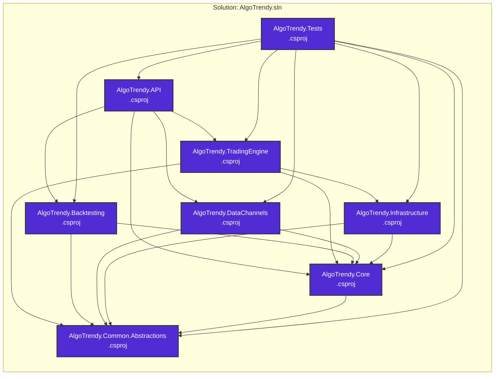

---

## 4. Data Flow Architecture

How data flows through the system from external sources to the user.

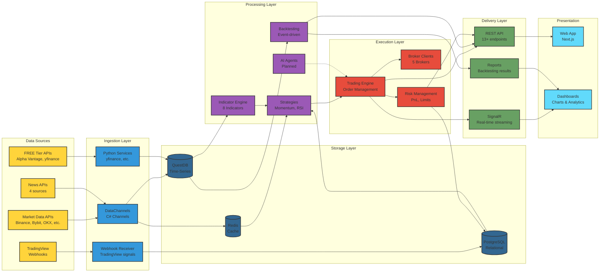

---

## 5. Broker Integration Architecture

Detailed view of broker implementations and abstraction layer.

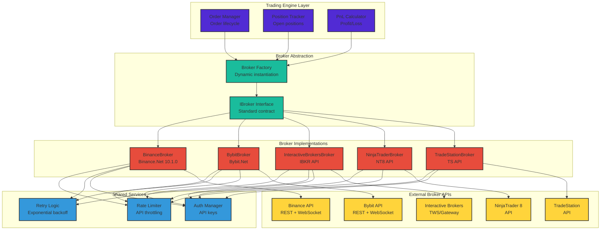

---

## 6. Backtesting Engine Flow

Event-driven backtesting system architecture.

```mermaid
flowchart TB
    START([Start Backtest])

    subgraph "Configuration"
        CONFIG[Load Configuration<br/>Symbol, Timeframe, Period]
        STRATEGY_SELECT[Select Strategy<br/>Momentum, RSI, etc.]
        PARAMS[Set Parameters<br/>Initial capital, fees]
    end

    subgraph "Data Loading"
        LOAD_DATA[Load Historical Data<br/>from QuestDB]
        VALIDATE[Validate Data<br/>Check completeness]
        PREPARE[Prepare Events<br/>Time-ordered]
    end

    subgraph "Event Processing Loop"
        NEXT_EVENT{Next Event?}
        UPDATE_TIME[Update Market Time]
        CALC_INDICATORS[Calculate Indicators<br/>SMA, EMA, RSI, etc.]
        STRATEGY_LOGIC[Execute Strategy Logic<br/>Generate signals]
        ORDER_GEN{Generate Order?}
    end

    subgraph "Order Execution Simulation"
        FILL_ORDER[Fill Order<br/>Market/Limit simulation]
        UPDATE_POS[Update Positions<br/>Track open/close]
        CALC_PNL[Calculate PnL<br/>Realized/Unrealized]
        UPDATE_EQUITY[Update Equity Curve]
    end

    subgraph "Performance Metrics"
        CALC_SHARPE[Sharpe Ratio]
        CALC_SORTINO[Sortino Ratio]
        CALC_DRAWDOWN[Max Drawdown]
        CALC_PROFIT_FACTOR[Profit Factor]
        CALC_WIN_RATE[Win Rate]
    end

    subgraph "Results"
        TRADES_SUMMARY[Trades Summary<br/>Win/Loss stats]
        EQUITY_CURVE[Equity Curve<br/>Capital over time]
        REPORT[Backtest Report<br/>Full analysis]
    end

    END([Return Results])

    START --> CONFIG
    CONFIG --> STRATEGY_SELECT
    STRATEGY_SELECT --> PARAMS
    PARAMS --> LOAD_DATA
    LOAD_DATA --> VALIDATE
    VALIDATE --> PREPARE
    PREPARE --> NEXT_EVENT

    NEXT_EVENT -->|Yes| UPDATE_TIME
    UPDATE_TIME --> CALC_INDICATORS
    CALC_INDICATORS --> STRATEGY_LOGIC
    STRATEGY_LOGIC --> ORDER_GEN

    ORDER_GEN -->|Yes| FILL_ORDER
    FILL_ORDER --> UPDATE_POS
    UPDATE_POS --> CALC_PNL
    CALC_PNL --> UPDATE_EQUITY
    UPDATE_EQUITY --> NEXT_EVENT

    ORDER_GEN -->|No| NEXT_EVENT

    NEXT_EVENT -->|No| CALC_SHARPE
    CALC_SHARPE --> CALC_SORTINO
    CALC_SORTINO --> CALC_DRAWDOWN
    CALC_DRAWDOWN --> CALC_PROFIT_FACTOR
    CALC_PROFIT_FACTOR --> CALC_WIN_RATE

    CALC_WIN_RATE --> TRADES_SUMMARY
    TRADES_SUMMARY --> EQUITY_CURVE
    EQUITY_CURVE --> REPORT
    REPORT --> END

    classDef config fill:#3498db,stroke:#333,stroke-width:2px
    classDef data fill:#9b59b6,stroke:#333,stroke-width:2px
    classDef process fill:#e74c3c,stroke:#333,stroke-width:2px
    classDef order fill:#f39c12,stroke:#333,stroke-width:2px
    classDef metrics fill:#1abc9c,stroke:#333,stroke-width:2px
    classDef results fill:#68a063,stroke:#333,stroke-width:2px

    class CONFIG,STRATEGY_SELECT,PARAMS config
    class LOAD_DATA,VALIDATE,PREPARE data
    class NEXT_EVENT,UPDATE_TIME,CALC_INDICATORS,STRATEGY_LOGIC,ORDER_GEN process
    class FILL_ORDER,UPDATE_POS,CALC_PNL,UPDATE_EQUITY order
    class CALC_SHARPE,CALC_SORTINO,CALC_DRAWDOWN,CALC_PROFIT_FACTOR,CALC_WIN_RATE metrics
    class TRADES_SUMMARY,EQUITY_CURVE,REPORT results
```

---

## 7. Data Channels Architecture

Multi-source data ingestion system.

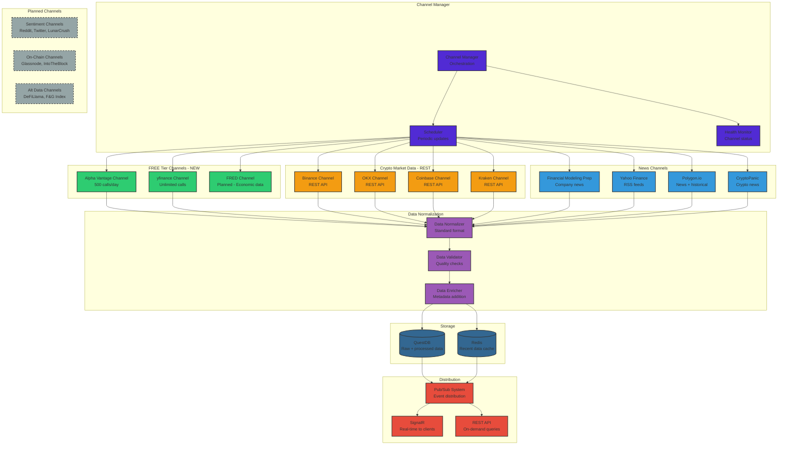

---

## 8. API Layer Structure

REST API endpoints and SignalR hubs organization.

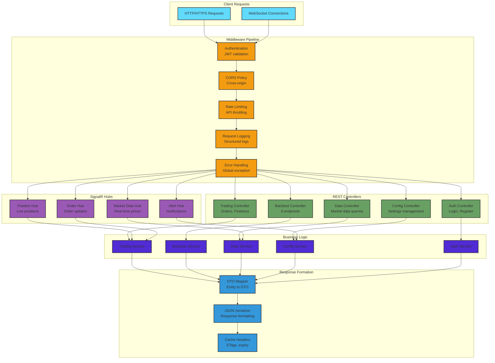

---

## 9. Database Architecture

Multi-database strategy for different data types.

```mermaid
graph TB
    subgraph "Application Layer"
        API_LAYER[API Services]
        TRADING_LAYER[Trading Engine]
        BACKTEST_LAYER[Backtesting Engine]
        DATA_LAYER[Data Channels]
    end

    subgraph "Data Access Layer"
        EF_CORE[Entity Framework Core<br/>PostgreSQL ORM]
        QUESTDB_CLIENT[QuestDB Client<br/>PostgreSQL wire protocol]
        REDIS_CLIENT[StackExchange.Redis<br/>Cache client]
    end

    subgraph "PostgreSQL 16 - Relational Data"
        PG_USERS[users<br/>User accounts]
        PG_ORDERS[orders<br/>Order history]
        PG_POSITIONS[positions<br/>Current positions]
        PG_CONFIGS[configurations<br/>System settings]
        PG_AUDIT[audit_logs<br/>Security audit]
        PG_STRATEGIES[strategies<br/>Strategy configs]
    end

    subgraph "QuestDB - Time-Series Data"
        QDB_OHLCV[ohlcv<br/>Candlestick data]
        QDB_TICKS[ticks<br/>Tick-by-tick data]
        QDB_ORDERBOOK[order_book<br/>Depth snapshots]
        QDB_TRADES[trades<br/>Executed trades]
        QDB_INDICATORS[indicators<br/>Calculated values]
        QDB_SIGNALS[signals<br/>Trading signals]
    end

    subgraph "Redis 7 - Cache & Messaging"
        REDIS_PRICE[Latest Prices<br/>Real-time cache]
        REDIS_POSITION[Position Cache<br/>Quick lookup]
        REDIS_SESSION[User Sessions<br/>Auth tokens]
        REDIS_SIGNALR[SignalR Backplane<br/>Message bus]
        REDIS_RATELIMIT[Rate Limit<br/>API throttling]
    end

    subgraph "Backup & Migration"
        PG_BACKUP[(PostgreSQL Backups<br/>Daily snapshots)]
        QDB_BACKUP[(QuestDB Backups<br/>Time-series archive)]
        LIQUIBASE[Liquibase<br/>Schema migrations]
    end

    API_LAYER --> EF_CORE
    API_LAYER --> REDIS_CLIENT

    TRADING_LAYER --> EF_CORE
    TRADING_LAYER --> QUESTDB_CLIENT
    TRADING_LAYER --> REDIS_CLIENT

    BACKTEST_LAYER --> QUESTDB_CLIENT

    DATA_LAYER --> QUESTDB_CLIENT
    DATA_LAYER --> REDIS_CLIENT

    EF_CORE --> PG_USERS
    EF_CORE --> PG_ORDERS
    EF_CORE --> PG_POSITIONS
    EF_CORE --> PG_CONFIGS
    EF_CORE --> PG_AUDIT
    EF_CORE --> PG_STRATEGIES

    QUESTDB_CLIENT --> QDB_OHLCV
    QUESTDB_CLIENT --> QDB_TICKS
    QUESTDB_CLIENT --> QDB_ORDERBOOK
    QUESTDB_CLIENT --> QDB_TRADES
    QUESTDB_CLIENT --> QDB_INDICATORS
    QUESTDB_CLIENT --> QDB_SIGNALS

    REDIS_CLIENT --> REDIS_PRICE
    REDIS_CLIENT --> REDIS_POSITION
    REDIS_CLIENT --> REDIS_SESSION
    REDIS_CLIENT --> REDIS_SIGNALR
    REDIS_CLIENT --> REDIS_RATELIMIT

    PG_USERS --> PG_BACKUP
    PG_ORDERS --> PG_BACKUP
    PG_CONFIGS --> LIQUIBASE

    QDB_OHLCV --> QDB_BACKUP
    QDB_TICKS --> QDB_BACKUP

    classDef app fill:#61dafb,stroke:#333,stroke-width:2px
    classDef dal fill:#3498db,stroke:#333,stroke-width:2px
    classDef postgres fill:#336791,stroke:#333,stroke-width:2px
    classDef questdb fill:#f39c12,stroke:#333,stroke-width:2px
    classDef redis fill:#dc382d,stroke:#333,stroke-width:2px
    classDef backup fill:#95a5a6,stroke:#333,stroke-width:2px

    class API_LAYER,TRADING_LAYER,BACKTEST_LAYER,DATA_LAYER app
    class EF_CORE,QUESTDB_CLIENT,REDIS_CLIENT dal
    class PG_USERS,PG_ORDERS,PG_POSITIONS,PG_CONFIGS,PG_AUDIT,PG_STRATEGIES postgres
    class QDB_OHLCV,QDB_TICKS,QDB_ORDERBOOK,QDB_TRADES,QDB_INDICATORS,QDB_SIGNALS questdb
    class REDIS_PRICE,REDIS_POSITION,REDIS_SESSION,REDIS_SIGNALR,REDIS_RATELIMIT redis
    class PG_BACKUP,QDB_BACKUP,LIQUIBASE backup
```

---

## 10. Deployment Architecture

Production deployment with 3-server geographic redundancy.

```mermaid
graph TB
    subgraph "Users"
        WEB_USERS[Web Users]
        API_CLIENTS[API Clients]
        MOBILE[Mobile Apps - Future]
    end

    subgraph "CDN & Load Balancing"
        CLOUDFLARE[Cloudflare<br/>CDN + DDoS protection]
        LB[Load Balancer<br/>Geographic routing]
    end

    subgraph "Chicago VPS #1 - Primary"
        CHI1_WEB[Next.js Frontend<br/>Static + SSR]
        CHI1_API[AlgoTrendy.API<br/>.NET 8]
        CHI1_ENGINE[Trading Engine<br/>Active]
        CHI1_PG[(PostgreSQL 16<br/>Primary)]
        CHI1_QDB[(QuestDB<br/>Active)]
        CHI1_REDIS[(Redis 7<br/>Primary)]
    end

    subgraph "Chicago VM #2 - Backup"
        CHI2_API[AlgoTrendy.API<br/>.NET 8]
        CHI2_ENGINE[Trading Engine<br/>Standby]
        CHI2_PG[(PostgreSQL 16<br/>Replica)]
        CHI2_QDB[(QuestDB<br/>Replica)]
        CHI2_REDIS[(Redis 7<br/>Replica)]
    end

    subgraph "CDMX VPS #3 - DR"
        CDMX_API[AlgoTrendy.API<br/>.NET 8]
        CDMX_ENGINE[Trading Engine<br/>DR]
        CDMX_PG[(PostgreSQL 16<br/>DR Replica)]
        CDMX_BACKUP[(Backup Storage<br/>S3-compatible)]
    end

    subgraph "Monitoring & Observability"
        GRAFANA[Grafana<br/>Dashboards]
        PROMETHEUS[Prometheus<br/>Metrics collection]
        SEQ[Seq<br/>Structured logging]
        PAGERDUTY[PagerDuty<br/>Alerting]
    end

    subgraph "CI/CD Pipeline"
        GITHUB[GitHub<br/>Source control]
        ACTIONS[GitHub Actions<br/>Build & deploy]
        DOCKER_REG[Docker Registry<br/>Container images]
    end

    subgraph "Secrets Management"
        AZURE_KV[Azure Key Vault<br/>API keys, passwords]
        ENV_VARS[Environment Variables<br/>Runtime config]
    end

    WEB_USERS --> CLOUDFLARE
    API_CLIENTS --> CLOUDFLARE
    MOBILE -.-> CLOUDFLARE

    CLOUDFLARE --> LB

    LB --> CHI1_WEB
    LB --> CHI1_API
    LB --> CHI2_API
    LB --> CDMX_API

    CHI1_WEB --> CHI1_API
    CHI1_API --> CHI1_ENGINE
    CHI1_ENGINE --> CHI1_PG
    CHI1_ENGINE --> CHI1_QDB
    CHI1_API --> CHI1_REDIS

    CHI2_API --> CHI2_ENGINE
    CHI2_ENGINE --> CHI2_PG
    CHI2_ENGINE --> CHI2_QDB
    CHI2_API --> CHI2_REDIS

    CHI1_PG -.->|Replication| CHI2_PG
    CHI1_QDB -.->|Replication| CHI2_QDB
    CHI1_REDIS -.->|Replication| CHI2_REDIS

    CHI1_PG -.->|Async Replication| CDMX_PG
    CHI1_PG -.->|Daily Backup| CDMX_BACKUP
    CHI1_QDB -.->|Daily Backup| CDMX_BACKUP

    CDMX_API --> CDMX_ENGINE
    CDMX_ENGINE --> CDMX_PG

    CHI1_API --> PROMETHEUS
    CHI2_API --> PROMETHEUS
    CDMX_API --> PROMETHEUS

    PROMETHEUS --> GRAFANA
    CHI1_API --> SEQ
    CHI2_API --> SEQ
    CDMX_API --> SEQ

    GRAFANA --> PAGERDUTY

    GITHUB --> ACTIONS
    ACTIONS --> DOCKER_REG
    DOCKER_REG --> CHI1_API
    DOCKER_REG --> CHI2_API
    DOCKER_REG --> CDMX_API

    CHI1_ENGINE --> AZURE_KV
    CHI2_ENGINE --> AZURE_KV
    CDMX_ENGINE --> AZURE_KV

    classDef users fill:#61dafb,stroke:#333,stroke-width:2px
    classDef cdn fill:#f39c12,stroke:#333,stroke-width:2px
    classDef chicago fill:#2ecc71,stroke:#333,stroke-width:2px
    classDef cdmx fill:#3498db,stroke:#333,stroke-width:2px
    classDef monitoring fill:#9b59b6,stroke:#333,stroke-width:2px
    classDef cicd fill:#e74c3c,stroke:#333,stroke-width:2px
    classDef secrets fill:#34495e,stroke:#333,stroke-width:2px

    class WEB_USERS,API_CLIENTS,MOBILE users
    class CLOUDFLARE,LB cdn
    class CHI1_WEB,CHI1_API,CHI1_ENGINE,CHI1_PG,CHI1_QDB,CHI1_REDIS chicago
    class CHI2_API,CHI2_ENGINE,CHI2_PG,CHI2_QDB,CHI2_REDIS chicago
    class CDMX_API,CDMX_ENGINE,CDMX_PG,CDMX_BACKUP cdmx
    class GRAFANA,PROMETHEUS,SEQ,PAGERDUTY monitoring
    class GITHUB,ACTIONS,DOCKER_REG cicd
    class AZURE_KV,ENV_VARS secrets
```

---

## 11. Trading Execution Flow

Order lifecycle from signal to execution.

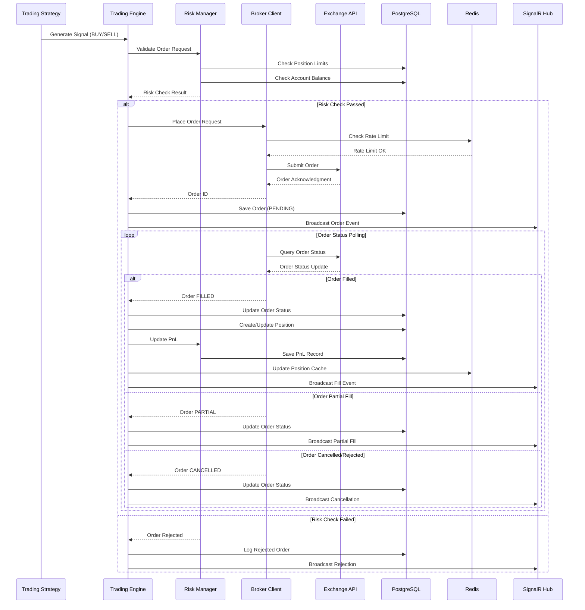

---

## 12. Real-Time Streaming Architecture

SignalR-based real-time data distribution.

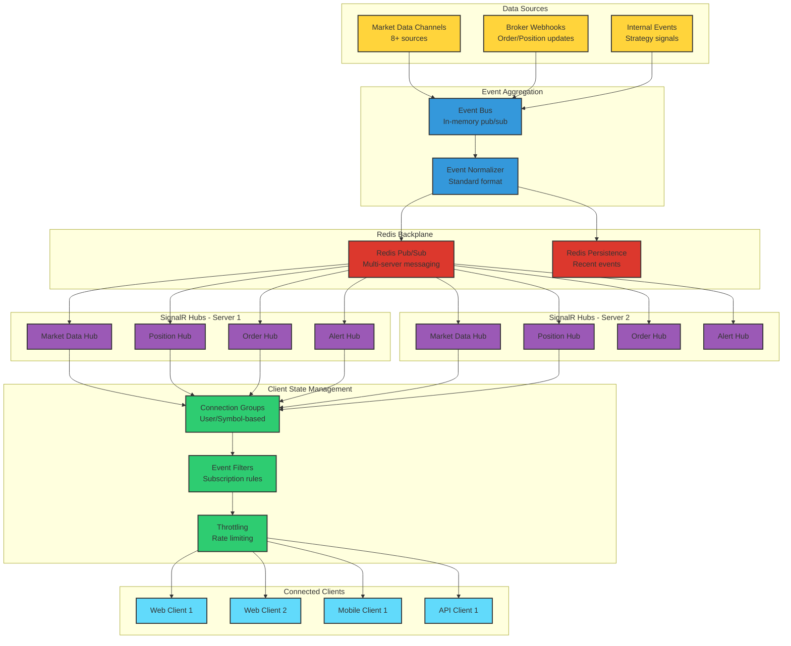

---

## 13. Security & Authentication Flow

JWT-based authentication with secrets management.

```mermaid
flowchart TB
    START([User Login Request])

    subgraph "Authentication Flow"
        LOGIN[POST /api/auth/login<br/>Username + Password]
        VALIDATE[Validate Credentials<br/>BCrypt hash check]
        CHECK_DB[(Query PostgreSQL<br/>users table)]
        AUTH_DECISION{Valid?}
    end

    subgraph "Token Generation"
        GEN_ACCESS[Generate Access Token<br/>JWT, 1 hour expiry]
        GEN_REFRESH[Generate Refresh Token<br/>30 day expiry]
        SIGN_TOKEN[Sign with Secret Key<br/>from Azure Key Vault]
        STORE_REFRESH[Store Refresh Token<br/>in PostgreSQL]
    end

    subgraph "Session Management"
        CACHE_SESSION[Cache Session<br/>in Redis]
        SET_CLAIMS[Set User Claims<br/>Roles, Permissions]
    end

    subgraph "API Request Authorization"
        API_REQ[API Request<br/>with Authorization header]
        EXTRACT[Extract JWT Token]
        VERIFY[Verify Token Signature]
        CHECK_EXPIRY{Token Valid?}
        CHECK_CACHE[Check Redis Cache<br/>Session active?]
        LOAD_USER[Load User Context]
        CHECK_PERMS{Has Permission?}
    end

    subgraph "Broker API Security"
        GET_KEYS[Retrieve API Keys<br/>from Azure Key Vault]
        DECRYPT[Decrypt Keys<br/>AES-256]
        RATE_LIMIT[Check Rate Limit<br/>Per broker]
        SIGN_REQ[Sign API Request<br/>HMAC-SHA256]
        CALL_BROKER[Call Broker API]
    end

    subgraph "Audit & Monitoring"
        LOG_AUTH[Log Auth Attempt<br/>PostgreSQL audit_logs]
        LOG_ACCESS[Log API Access<br/>Seq structured logs]
        ALERT{Suspicious?}
        NOTIFY[Send Alert<br/>PagerDuty]
    end

    REJECT([401 Unauthorized])
    SUCCESS([200 OK + Tokens])
    EXECUTE([Execute API Call])

    START --> LOGIN
    LOGIN --> VALIDATE
    VALIDATE --> CHECK_DB
    CHECK_DB --> AUTH_DECISION

    AUTH_DECISION -->|Invalid| LOG_AUTH
    LOG_AUTH --> REJECT

    AUTH_DECISION -->|Valid| GEN_ACCESS
    GEN_ACCESS --> GEN_REFRESH
    GEN_REFRESH --> SIGN_TOKEN
    SIGN_TOKEN --> STORE_REFRESH
    STORE_REFRESH --> CACHE_SESSION
    CACHE_SESSION --> SET_CLAIMS
    SET_CLAIMS --> LOG_AUTH
    LOG_AUTH --> SUCCESS

    API_REQ --> EXTRACT
    EXTRACT --> VERIFY
    VERIFY --> CHECK_EXPIRY

    CHECK_EXPIRY -->|Expired| REJECT
    CHECK_EXPIRY -->|Valid| CHECK_CACHE
    CHECK_CACHE -->|Not Found| REJECT
    CHECK_CACHE -->|Active| LOAD_USER
    LOAD_USER --> CHECK_PERMS

    CHECK_PERMS -->|Denied| LOG_ACCESS
    LOG_ACCESS --> ALERT
    ALERT -->|Yes| NOTIFY
    NOTIFY --> REJECT
    ALERT -->|No| REJECT

    CHECK_PERMS -->|Granted| GET_KEYS
    GET_KEYS --> DECRYPT
    DECRYPT --> RATE_LIMIT
    RATE_LIMIT --> SIGN_REQ
    SIGN_REQ --> CALL_BROKER
    CALL_BROKER --> LOG_ACCESS
    LOG_ACCESS --> EXECUTE

    classDef auth fill:#3498db,stroke:#333,stroke-width:2px
    classDef token fill:#2ecc71,stroke:#333,stroke-width:2px
    classDef session fill:#9b59b6,stroke:#333,stroke-width:2px
    classDef api fill:#f39c12,stroke:#333,stroke-width:2px
    classDef broker fill:#e74c3c,stroke:#333,stroke-width:2px
    classDef audit fill:#34495e,stroke:#333,stroke-width:2px

    class LOGIN,VALIDATE,CHECK_DB,AUTH_DECISION auth
    class GEN_ACCESS,GEN_REFRESH,SIGN_TOKEN,STORE_REFRESH token
    class CACHE_SESSION,SET_CLAIMS session
    class API_REQ,EXTRACT,VERIFY,CHECK_EXPIRY,CHECK_CACHE,LOAD_USER,CHECK_PERMS api
    class GET_KEYS,DECRYPT,RATE_LIMIT,SIGN_REQ,CALL_BROKER broker
    class LOG_AUTH,LOG_ACCESS,ALERT,NOTIFY audit
```

---

## 14. External Integrations Map

All external systems and their integration points.

```mermaid
graph TB
    subgraph "AlgoTrendy Core"
        CORE_SYS[AlgoTrendy<br/>Platform]
    end

    subgraph "Trading Brokers"
        BINANCE_EX[Binance Exchange<br/>REST + WebSocket]
        BYBIT_EX[Bybit Exchange<br/>REST + WebSocket]
        IB_EX[Interactive Brokers<br/>TWS/Gateway]
        NINJA_EX[NinjaTrader 8<br/>API]
        TS_EX[TradeStation<br/>API]
    end

    subgraph "Market Data - FREE Tier"
        ALPHA_API[Alpha Vantage<br/>500 calls/day<br/>Stocks, Forex, Crypto]
        YFINANCE_API[yfinance<br/>Unlimited<br/>Options, Fundamentals]
        FRED_API[FRED<br/>Planned<br/>816K+ indicators]
    end

    subgraph "Market Data - Crypto"
        BINANCE_DATA[Binance Data API<br/>Real-time crypto]
        OKX_DATA[OKX Data API<br/>Real-time crypto]
        COINBASE_DATA[Coinbase Data API<br/>Real-time crypto]
        KRAKEN_DATA[Kraken Data API<br/>Real-time crypto]
    end

    subgraph "News & Information"
        FMP_API[Financial Modeling Prep<br/>Company news]
        YAHOO_API[Yahoo Finance<br/>RSS feeds]
        POLYGON_API[Polygon.io<br/>News + historical]
        CRYPTOPANIC_API[CryptoPanic<br/>Crypto news]
    end

    subgraph "External Trading Systems"
        TRADINGVIEW[TradingView<br/>Webhook alerts]
        FREQTRADE_SYS[Freqtrade<br/>Multi-bot portfolio<br/>Ports 8082-8084]
        OPENALGO[OpenAlgo<br/>Strategy execution]
    end

    subgraph "AI & ML Services - Planned"
        OPENAI[OpenAI API<br/>GPT-4 for analysis]
        PINECONE[Pinecone<br/>Vector database]
        LUNARCRUSH[LunarCrush<br/>Social sentiment]
    end

    subgraph "Infrastructure Services"
        AZURE_KV_EXT[Azure Key Vault<br/>Secrets management]
        CLOUDFLARE_EXT[Cloudflare<br/>CDN + DDoS]
        PAGERDUTY_EXT[PagerDuty<br/>Alerting]
        SEQ_EXT[Seq<br/>Structured logging]
    end

    subgraph "Development Tools"
        GITHUB_EXT[GitHub<br/>Source control + CI/CD]
        DOCKER_HUB[Docker Hub<br/>Container registry]
    end

    CORE_SYS -->|Order Execution| BINANCE_EX
    CORE_SYS -->|Order Execution| BYBIT_EX
    CORE_SYS -->|Order Execution| IB_EX
    CORE_SYS -->|Order Execution| NINJA_EX
    CORE_SYS -->|Order Execution| TS_EX

    CORE_SYS -->|Market Data| ALPHA_API
    CORE_SYS -->|Market Data| YFINANCE_API
    CORE_SYS -->|Market Data| FRED_API

    CORE_SYS -->|Market Data| BINANCE_DATA
    CORE_SYS -->|Market Data| OKX_DATA
    CORE_SYS -->|Market Data| COINBASE_DATA
    CORE_SYS -->|Market Data| KRAKEN_DATA

    CORE_SYS -->|News Feed| FMP_API
    CORE_SYS -->|News Feed| YAHOO_API
    CORE_SYS -->|News Feed| POLYGON_API
    CORE_SYS -->|News Feed| CRYPTOPANIC_API

    TRADINGVIEW -->|Webhooks| CORE_SYS
    CORE_SYS -->|API Polling| FREQTRADE_SYS
    CORE_SYS -->|Strategy Execution| OPENALGO

    CORE_SYS -.->|AI Requests| OPENAI
    CORE_SYS -.->|Vector Search| PINECONE
    CORE_SYS -.->|Sentiment Data| LUNARCRUSH

    CORE_SYS -->|Secrets| AZURE_KV_EXT
    CORE_SYS -->|CDN| CLOUDFLARE_EXT
    CORE_SYS -->|Alerts| PAGERDUTY_EXT
    CORE_SYS -->|Logs| SEQ_EXT

    GITHUB_EXT -->|Deploy| CORE_SYS
    DOCKER_HUB -->|Images| CORE_SYS

    classDef core fill:#512bd4,stroke:#333,stroke-width:3px,color:#fff
    classDef broker fill:#e74c3c,stroke:#333,stroke-width:2px
    classDef free fill:#2ecc71,stroke:#333,stroke-width:2px
    classDef crypto fill:#f39c12,stroke:#333,stroke-width:2px
    classDef news fill:#3498db,stroke:#333,stroke-width:2px
    classDef external fill:#9b59b6,stroke:#333,stroke-width:2px
    classDef ai fill:#e91e63,stroke:#333,stroke-width:2px,stroke-dasharray: 5 5
    classDef infra fill:#34495e,stroke:#333,stroke-width:2px
    classDef devtools fill:#95a5a6,stroke:#333,stroke-width:2px

    class CORE_SYS core
    class BINANCE_EX,BYBIT_EX,IB_EX,NINJA_EX,TS_EX broker
    class ALPHA_API,YFINANCE_API,FRED_API free
    class BINANCE_DATA,OKX_DATA,COINBASE_DATA,KRAKEN_DATA crypto
    class FMP_API,YAHOO_API,POLYGON_API,CRYPTOPANIC_API news
    class TRADINGVIEW,FREQTRADE_SYS,OPENALGO external
    class OPENAI,PINECONE,LUNARCRUSH ai
    class AZURE_KV_EXT,CLOUDFLARE_EXT,PAGERDUTY_EXT,SEQ_EXT infra
    class GITHUB_EXT,DOCKER_HUB devtools
```

---

## Summary

This document provides 14 comprehensive Mermaid diagrams covering every aspect of AlgoTrendy v2.6:

1. **System Architecture** - Complete platform overview
2. **Backend Components** - Detailed .NET project structure
3. **.NET Solution** - Project dependencies
4. **Data Flow** - End-to-end data movement
5. **Broker Integration** - Trading broker architecture
6. **Backtesting Engine** - Event-driven backtesting flow
7. **Data Channels** - Multi-source data ingestion
8. **API Layer** - REST and SignalR architecture
9. **Database Architecture** - Multi-database strategy
10. **Deployment** - 3-server production topology
11. **Trading Execution** - Order lifecycle sequence
12. **Real-Time Streaming** - SignalR distribution
13. **Security** - Authentication and authorization flow
14. **External Integrations** - All third-party connections

**Total Coverage:** Every major component, data flow, integration point, and architectural decision mapped visually.

---

**Document Version:** 1.0
**Last Updated:** October 19, 2025
**Maintained By:** AlgoTrendy Development Team
